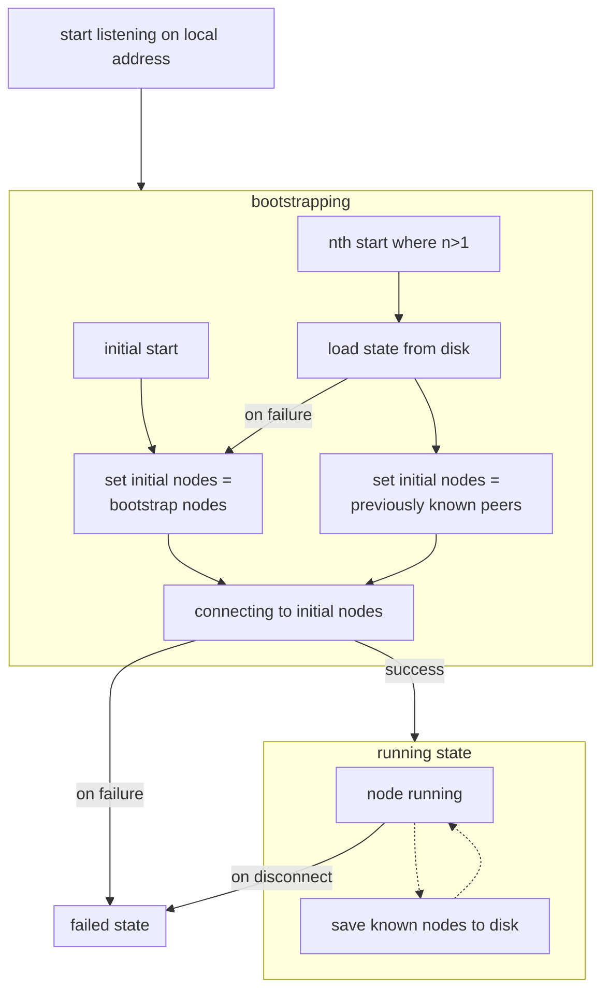

# Networking

The networking stack is provided by [rust-libp2p](https://github.com/libp2p/rust-libp2p).

When starting a new magic-recall node a new p2p node is started. It is planned to have an always running default boostrap node. Peer discovery should also work in the local network. 
New nodes first connect to this boostrap node and then discover new peers from there. In order to provide decentralized hole punching a number of nodes will be promoted to relays using AutoNAT and AutoRelay. ([#12](https://github.com/inosms/magic-recall/issues/12))

Discovery of public addresses of nodes in the friend list is done via the Kademlia DHT.

